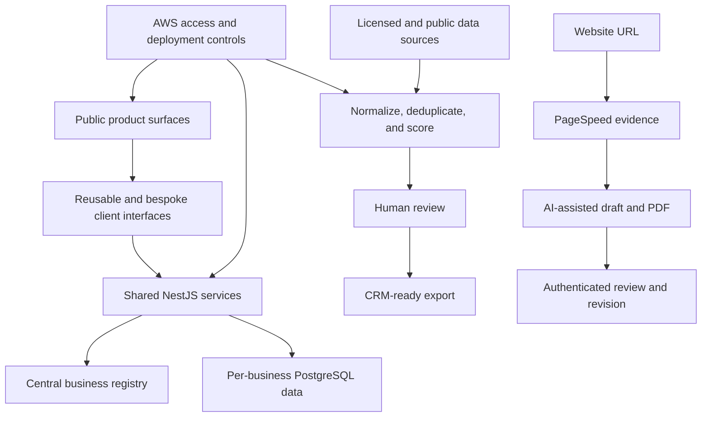

# Jakomu Platform Engineering

Case study of my current full-stack, data, and cloud systems work at [Jakomu](https://www.jakomu.net/).

> Jakomu source code, customer information, lead data, credentials, and internal operating material remain private. This case study uses public product surfaces, sanitized system descriptions, and metrics that can be discussed publicly.

## Context

Jakomu delivers managed websites, business tools, and tailored software. The engineering challenge is to combine reusable foundations with client-specific interfaces while keeping deployment, maintenance, data quality, and cloud cost manageable as the customer base grows.

I work as a Software Developer across the interface, backend, data, cloud, and verification layers. My work includes public product experiences, bespoke client workflows, shared NestJS and PostgreSQL services, AWS infrastructure, lead-data systems, and AI-assisted website audits.

## What I built

- Reusable React and Next.js foundations plus bespoke client interfaces shaped around individual business needs
- Shared NestJS services with a central business registry and separate operational databases for tenant boundaries
- AWS deployment and access patterns using Amplify, S3, Lambda, DynamoDB, Route 53 and DNS, IAM, and SSO
- An end-to-end lead sourcing and scoring pipeline using licensed stored profiles, Google aggregate market data, public IRS and Census data, ZIP scoring, website scoring, deduplication, enrichment, human review, and HubSpot-ready exports
- A website-audit workflow that combines PageSpeed Insights evidence with Gemini-generated recommendations and PDFs, followed by authenticated salesperson review, controlled revisions, and human approval
- Automated checks across responsive interfaces, APIs, data-processing behavior, and release gates

## System view

## Engineering decisions

### Reuse the platform without forcing identical client experiences

Shared services and interface foundations reduce repeated implementation work, while client-facing workflows remain adaptable to the needs of each business.

### Separate tenant discovery from tenant operations

A central registry identifies the business and its configuration. Operational data remains separated per business, which keeps tenant boundaries explicit while allowing shared deployment and maintenance patterns.

### Keep cloud cost proportional to demand

I decoupled the corporate site from the multi-tenant backend and moved the public surface to serverless AWS hosting. That reduced projected pre-customer cloud spend to roughly one-third of a full-platform deployment while preserving the larger backend for activation as demand requires it.

### Store permitted provider data instead of repeating live lookups

Provider benchmarking modeled a **94% lower cost per contact-complete record** than Google Places. Durable stored results also removed repeated live lookups from the sales workflow.

### Keep people in control of AI output

The audit workflow treats generated recommendations as a draft. Authenticated users can accept or revise the result within rate limits, and a person remains responsible for the final client-facing output.

## Verification

The private monorepo uses unit, integration, accessibility, and browser checks across public sites, internal tools, APIs, and data workflows. My current work includes Vitest and Playwright coverage, CI build gates, local browser verification, and production-surface checks.

## Public evidence

- [Jakomu](https://www.jakomu.net/)
- [Jakomu portfolio case study](https://renaldomusto.com/work/jakomu/)
- [Engineering proof and verification](https://renaldomusto.com/proof/)

## Technology

`TypeScript` `React` `Next.js` `NestJS` `PostgreSQL` `AWS` `S3` `Amplify` `Lambda` `DynamoDB` `Route 53` `IAM` `SSO` `HubSpot` `Playwright` `Vitest`

